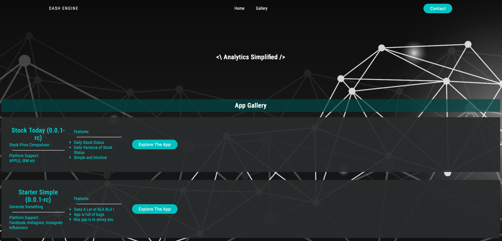
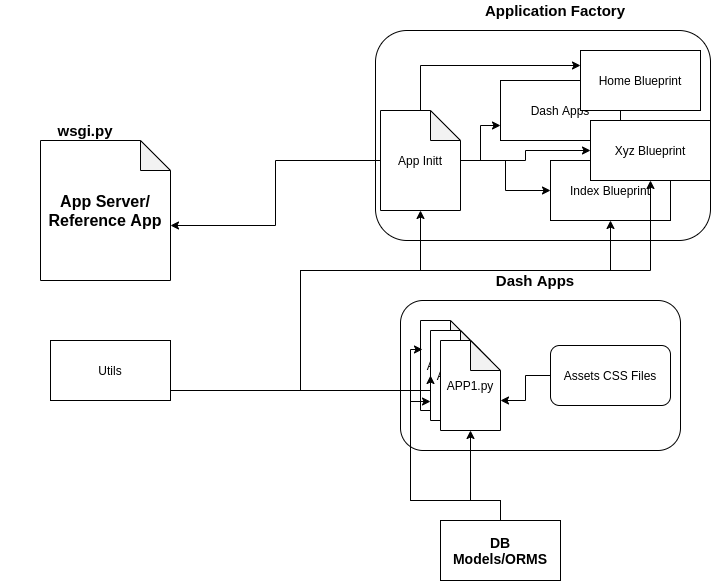

# Dash Engine
Compose Multiple Dash App under one flask server. 

Dash Engine is a flask application, designed to compose multiple dash apps into a 
single parent flask server and can be accessed through multiple user. The main 
core component of dash engine is flask, dash by Plotly and gunicorn production 
server. The main benefit of having a fully featured flask server app on top of dash
is now we are able to use blueprint and other security features easily on the server
side.

## The Main Challenges
It is fairly simple to write dash apps. But there is no clear instruction on 
how to deploy multiple dash apps. The other way is to purchase the dash enterprise. But
using Dash Engine now we made it fairly easy to deploy dash apps in a minute.

## History
The project is derived from a POC in Socialbakers. We were doing a lot of adhoc stuff
for sales and marketing to generate csv reports and visuals. So we want them to have
a self service platform, where they can change the parameters and get these kind of 
reports without bothering the Analytics Team with such simple request. Soon we realise
we are going to have lot of independent single page apps and we need separate servers
for each app. Then we went through numerous examples but none of them had perfect 
solutions. But combining all of those technique we were able to build a platform which
can serve our needs. We have used flask application factory design to build out app.

*Usually people are afraid of using company backed application; that's why I am open
sourcing it with MIT license and going to maintain it personally with some other
interested maintainer who helped me to build the app; so do not hesitate to use it.*

## Flask Application Factory
The core design of Dash Engine is based on [Application Factory Design Pattern of
flask](https://flask.palletsprojects.com/en/1.1.x/patterns/appfactories/). You 
can ready more about that in the reference section.

When we explore the app, we will notice all the application such as home, dash 
are independent and the app init file is composing them together and hand it 
over to `wsgi.py`. The each dash app is also independent and connected via app init. Apps can have 
their own database models or ORM and can be linked independently. The all  common 
generic utility functions are in the `Utils` folder.

Any kind of local json files or csv file can be stored in the instances folder.
Each application has its own route which is controlled via app init file. The 
route are also linked to landing page via `jina2` template engine.

## How to Comply with the Design
Most dash apps are written in a global scope, which is not going to work in 
that case as application have to be a function to be able to add to the main 
init server composition. The `example` directory provides an example app can 
be run locally using `python examples/stocktoday.py`. The functional form of 
same app can be fund in the `dash/application/stocktoday.py` file.

## How Run the App
You can clone the repository Install all the requirements in a virtual environment 
and run the code in the `helper.sh` fine to initiate the development server locally. 
To run in the production grade server have a look on the `Procfile`.

## Ideal Way to Write Apps
Before adding the app into Dash Engine (Ex: applications/dash/) its better to write
the app stand alone, which will give you all debug capability. The `examples` is for
that purpose. For example firs we have write the Stocktoday as Dash app and test every
aspect of the app when we are satisfied with that we moved that app in to 
`applications/dash/stocktoday.py` and create a modularised version to add that into
init file.

## Things are missing
We did not do any unit testing of the application. So in future we are planning for
that. We also have plant to add more example pass such as: funnel, A/B test, Time series,
Public API call dashboards.

*The project is not going to PIP as a installable package. Some developer should use
the framework if only they understand the architecture. But we are open for any 
suggestion, naming conventions. If someone want to contribute we will happily 
include them. We are not able to help if you generate some bug on an windows machine,
because we have tested that app on Unix and Linux Machine and we do not have access to
any windows machine currently*

#References
We would like to mention some document we have used as helps through out the project.
The background image is take from free website. So we would like to add the license 
term for that image to. The background image license can be found in 
licenses/background-licenses.txt file.

1. https://hackersandslackers.com/flask-application-factory/ (Example Framework)
2. https://github.com/Neo-Hao/mean-review-collector (Factory Design Example)
3. Flask Framework Cookbook
